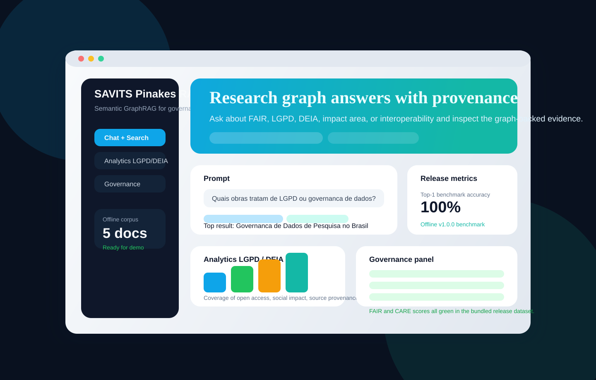

# SAVITS Pinakes RAG

<p align="center">
  
</p>

Semantic GraphRAG prototype for the Pinakes / BrCris ecosystem, combining RDF knowledge graphs, FAIR/CARE governance checks, LGPD-aware normalization, and a Streamlit experience for search, analytics, and decision support.

## Release Snapshot

- **Release target:** `v1.0.0`
- **Live app surface:** Streamlit UI in `app.py`
- **Offline corpus:** 5 curated records
- **Enriched graph:** 155 RDF triples
- **Governance coverage:** 100% across FAIR and CARE checks in the bundled dataset
- **Benchmark:** [`reports/benchmark_v1.0.0.md`](reports/benchmark_v1.0.0.md)

## Why This Matters

- **Shorter time-to-answer for research governance teams.** Instead of manually opening multiple repositories, the prototype centralizes metadata, provenance, access rights, and impact annotations in one queryable graph.
- **Lower compliance risk.** LGPD, FAIR, and CARE attributes are normalized into the graph, making governance gaps visible before publication or reuse.
- **Better decision support for funding and stewardship.** The app can surface which works are open, reusable, socially relevant, or weak on provenance, which helps prioritize curation and investment.
- **A practical bridge from demo to pilot.** The architecture is simple enough to run as a reproducible prototype, but already structured around real connectors, provenance, and benchmarkable outputs.

## Architecture


### Flow

1. **Ingestion** pulls records from BrCris, BDTD, Oasisbr, and OpenAlex, with offline fallbacks to the bundled dataset.
2. **Normalization** adds persistent identifiers, LGPD legal basis, DEIA tags, and normalized impact labels.
3. **Knowledge graph build** serializes the enriched corpus into Turtle for local SPARQL-style retrieval and governance inspection.
4. **Experience layer** exposes search, chat, analytics, and governance tabs in Streamlit.
5. **Evaluation** validates FAIR/CARE coverage and runs a lightweight retrieval benchmark for each release.

## Benchmark

The repository now ships a reproducible offline benchmark:

```bash
python -m src.evaluation.simple_benchmark
```

Current `v1.0.0` results from [`reports/benchmark_v1.0.0.md`](reports/benchmark_v1.0.0.md):

| Metric | Result |
| --- | --- |
| Documents | 5 |
| Enriched graph triples | 155 |
| Source mix | 3 BrCris, 1 BDTD, 1 OpenAlex fallback |
| Retrieval Top-1 accuracy | 100% |
| Retrieval Top-3 accuracy | 100% |
| Median retrieval latency | 0.054 ms |
| P95 retrieval latency | 0.098 ms |
| FAIR/CARE issues | 0 |

This benchmark is intentionally small and release-oriented. It is useful for regression detection and demos, not as a substitute for a large-scale IR evaluation.

## Quick Start

1. Build the graphs:

   ```bash
   python build_graph.py
   ```

2. Run the governance validator:

   ```bash
   python -m src.governance.fair_validator pinakes_graph.ttl > reports/governance_report.json
   ```

3. Start the app:

   ```bash
   streamlit run app.py
   ```

4. Run tests:

   ```bash
   pytest
   ```

## What Changed For v1.0.0

- Added release-quality README assets, including a demo screenshot and architecture image.
- Added a reproducible benchmark with JSON and Markdown outputs.
- Added `ROADMAP.md` and `CHANGELOG.md`.
- Restored the missing ingestion support module required by `build_graph.py`.
- Hardened the offline pipeline and added tests for cache utilities and offline graph generation.

## Project Files

- [`ROADMAP.md`](ROADMAP.md)
- [`CHANGELOG.md`](CHANGELOG.md)
- [`docs/chat_eval_prompts.md`](docs/chat_eval_prompts.md)
- [`reports/governance_report.json`](reports/governance_report.json)
- [`reports/benchmark_v1.0.0.md`](reports/benchmark_v1.0.0.md)

## Notes

- The Hugging Face Space front matter is now configured with `pinned: true`.
- `build_graph.py` now runs without relying on special console encoding settings on Windows.
- The offline dataset is intentionally compact so the demo remains deterministic and fast to validate.
